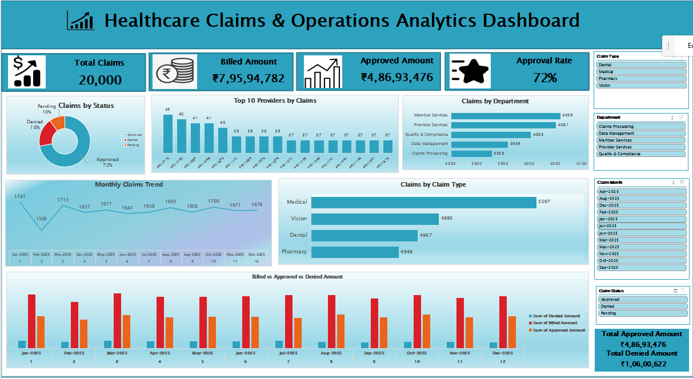

# Healthcare Claims & Operations Analytics

## Project Overview
This project analyzes 20,000 healthcare claims records to understand claim volumes, approval and denial patterns, financial performance, provider performance, and operational trends.

## Tools Used
- Microsoft Excel / WPS Spreadsheet
- Power Query
- Pivot Tables
- Excel Formulas
- Charts & Dashboard

## Key Analysis
- Total Claims
- Billed, Approved & Denied Amounts
- Approval & Denial Rates
- Claims by Status, Type and Department
- Monthly Claims Trend
- Provider-wise Performance
- Average Processing Time

## Dashboard
An interactive dashboard was created to provide a clear overview of healthcare claims and operations performance.

## Key KPIs
- Total Claims: 20,000
- Total Billed Amount: ₹7,95,94,782
- Total Approved Amount: ₹4,86,93,476
- Approval Rate: 72%
- Average Processing Time: 4.5 Days
